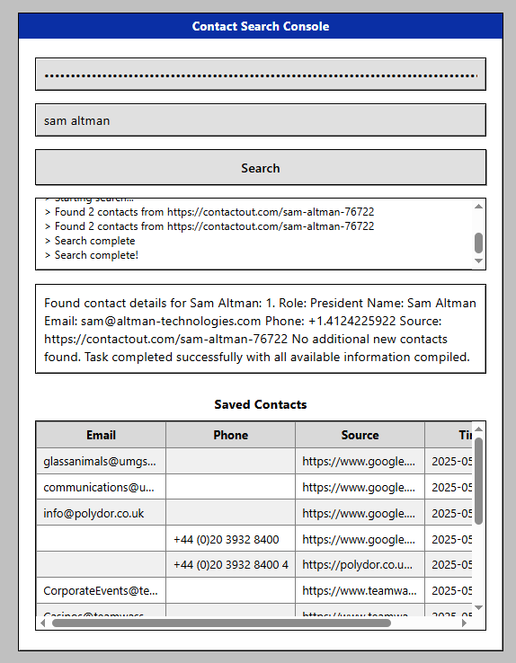

<div align="center">


**Real-time, AI-powered contact hunting — now with Windows-95 vibes**  
<br/>

<!-- badges -->
<a href="LICENSE"></a>

<a href="https://github.com/boshjerns/BrowserUse--Contact-Discovery-Agent/issues">
  
</a>
<a href="https://github.com/boshjerns/BrowserUse--Contact-Discovery-Agent/stargazers">
  
</a>

<br/><br/>


</div>

---

## ✨ Key Features

| ⚡ Feature | 🚀 What It Delivers |
|-----------|--------------------|
| **Live browser automation** | Chrome/Edge driven by [Browser-Use](https://docs.browser-use.com) with smart retries & captcha handling |
| **Instant progress feed**   | WebSocket logs update in real time — no more staring at a spinner |
| **LLM-assisted parsing**    | LangChain + OpenAI extract emails/phones from messy HTML |
| **Deduped contact vault**   | Normalizes & stores contacts in SQLite; swap in Postgres if you like |
| **Secure secrets**          | AES-GCM–encrypted API keys (no plaintext in Git or logs) |
| **Retro Win-95 UI**         | Pixel-perfect buttons, grey panels & a splash of neon |

---

## 📸 Screenshots

<table>
  <tr>
    <td align="center"></td>
    <td align="center"></td>
    <td align="center"></td>
  </tr>
</table>

<details>
<summary>More screenshots (click to expand)</summary>

<p align="center">
  
  
</p>

</details>

---

## 🗺️ How It Works

```mermaid
flowchart TD
    subgraph Frontend (Flask)
        UI[Retro Win-95 UI] --> WS(WebSocket)
    end
    subgraph Backend
        WS --> Worker["Async Task<br/>(Browser-Use + LangChain)"]
        Worker --> DB[(SQLite)]
        Worker -->|contact JSON| UI
    end
```

---

## 🚀 Quick Start

```bash
git clone https://github.com/boshjerns/BrowserUse--Contact-Discovery-Agent.git
cd BrowserUse--Contact-Discovery-Agent
pip install -r requirements.txt
python app.py            # then open http://127.0.0.1:5000
```

> **Heads-up:** first run grabs the Docker Chromium image (≈ 100 MB) — subsequent launches are instant.

---

## 🙌 Contributing

Bug reports and PRs welcome!  
If you build something cool on top of this, let me know — I’ll add a “made-with” showcase.

## 📖 License

[MIT](LICENSE)
