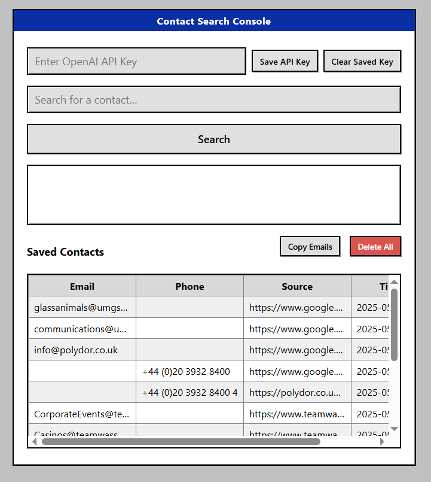
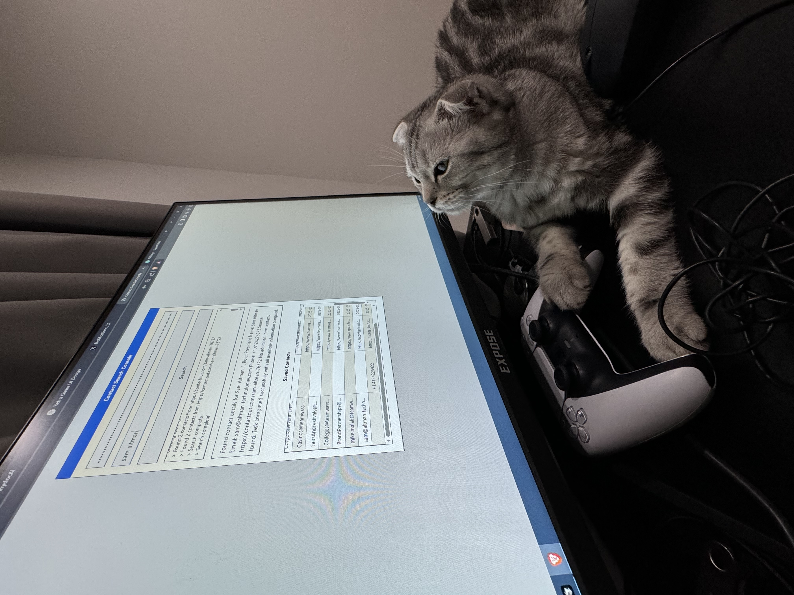
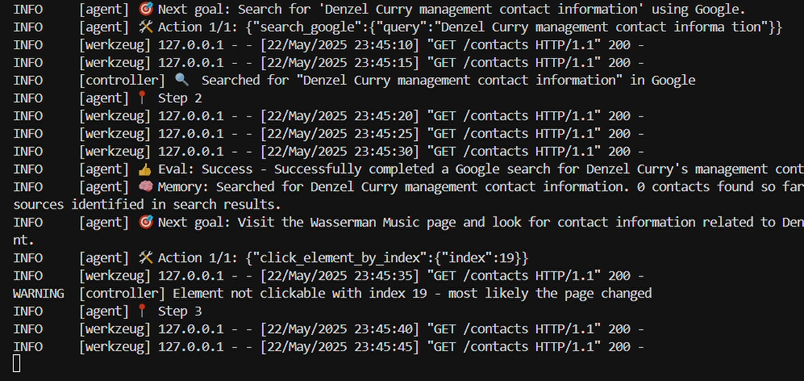

<div align="center">

# 🔎 Browser-Use Contact Discovery Agent  
**Real-time, AI-powered contact hunting with a dash of Windows-95 nostalgia**

[](LICENSE)

[](https://github.com/boshjerns/BrowserUse--Contact-Discovery-Agent/issues)
[](https://github.com/boshjerns/BrowserUse--Contact-Discovery-Agent/stargazers)

</div>

A lightweight Flask app that automates your browser to scour the web for **emails, phone numbers, and social handles**—then streams the results to you in real time. Perfect for founders, recruiters, sales teams, and curious hackers who need fresh contacts _now_ rather than _sometime next week_.

---

## ✨ Key Features

| ⚡ Feature | 🚀 What It Delivers |
|-----------|--------------------|
| **Live browser automation** | Chrome/Edge driven by [Browser-Use](https://docs.browser-use.com) with smart retries and captcha handling |
| **Instant progress feed**   | WebSocket logs update as each page is parsed—no more staring at a loading spinner |
| **LLM-assisted parsing**    | LangChain + OpenAI extract structured contacts from messy HTML |
| **Deduped contact vault**   | Normalizes & stores contacts in `sqlite` (or plug in Postgres) to avoid duplicates |
| **Secure secrets**          | AES-GCM–encrypted API keys; no plaintext keys in Git or logs |
| **Retro Win-95 UI**         | Pixel-perfect buttons, gray panels, and a splash of neon green for that _dial-up_ vibe |

---

## 📸 Screenshots

|  |  |  |
|:----------------------------------------------------------------------------------------------:|:-------------------------------------------------------------------------------------------:|:------------------------------------------------------------------------------------------:|

> _Don't see images?_ If you're viewing this on GitHub, the images above should be visible. If running locally and they are missing, ensure they are placed in the `docs/screenshots/` directory.

---

## 🚀 Quick Start

```bash
# 1. Clone
git clone https://github.com/boshjerns/BrowserUse--Contact-Discovery-Agent.git
cd BrowserUse--Contact-Discovery-Agent

# 2. Install deps (create a venv if you like)
pip install -r requirements.txt

# 3. Fire it up
python app.py
