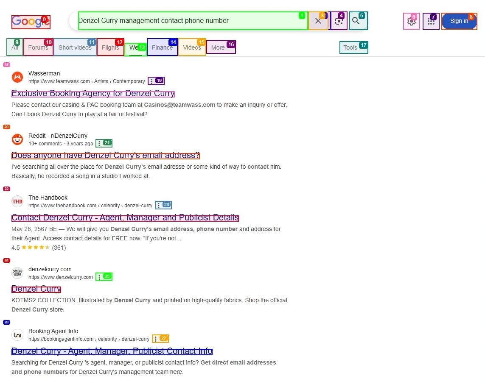

<div align="center">

# 🔎 Browser-Use-X-Interaction-Agent  
**Real-time, AI-powered contact hunting with a dash of Windows-95 nostalgia**

[](LICENSE)

[](https://github.com/boshjerns/Browser-Use-X-Interaction-Agent/issues)
[](https://github.com/boshjerns/Browser-Use-X-Interaction-Agent/stargazers)

</div>

A lightweight Flask app that automates your browser to scour the web for **emails, phone numbers, and social handles** — then streams the results to you in real time. Perfect for founders, recruiters, sales teams, and curious hackers who need fresh contacts **now** rather than **sometime next week**.

---

## ✨ Key Features

| ⚡ Feature | 🚀 What It Delivers |
|-----------|--------------------|
| **Live browser automation** | Chrome/Edge driven by [Browser-Use](https://docs.browser-use.com) with smart retries and captcha handling |
| **Instant progress feed**   | WebSocket logs update as each page is parsed—no more staring at a loading spinner |
| **LLM-assisted parsing**    | LangChain + OpenAI extract structured contacts from messy HTML |
| **Deduped contact vault**   | Normalizes contacts and stores them in a local `contacts.json` file to avoid duplicates |
| **Secure secrets**          | User-provided API keys (e.g., for OpenAI) are encrypted using Fernet (AES in CBC mode with HMAC) from the `cryptography` library. The master encryption key is stored locally in `.api_key`, and the encrypted user API key is stored in `.encrypted_api_key`. Both files are correctly listed in `.gitignore` to prevent them from being committed to version control. Decrypted keys are held in memory only when actively being used by the application. |
| **Retro Win-95 UI**         | Pixel-perfect buttons, gray panels, and a splash of neon green for that _dial-up_ vibe |

---

## 📸 Screenshots

| Screenshot 1 | Screenshot 2 | Screenshot 3 |
|-------------|--------------|--------------|
|  |  |  |

<p align="center">
  
</p>

> _Don't see images?_ Make sure the files live in `docs/screenshots/`.

---

## 🚀 Quick Start

```bash
# 1 Clone the repo
git clone https://github.com/boshjerns/Browser-Use-X-Interaction-Agent.git
cd Browser-Use-X-Interaction-Agent

# 2 Install deps (create a venv if you like)
pip install -r requirements.txt

# 3 Provide your OpenAI key  
# • EITHER export it as an env var …
export OPENAI_API_KEY="sk-…"           # Windows PowerShell: setx OPENAI_API_KEY "sk-…"
# • OR simply paste it into the UI when the app starts — no env setup required.

# 4 Fire it up
python app.py                          # then open http://127.0.0.1:5000
```

---

## 🔑 Environment Variables

| Variable | Purpose | Default |
|----------|---------|---------|
| `OPENAI_API_KEY`       | LLM calls for parsing & reasoning (optional — can be entered in the UI) | *none* |

---

## 🏆 Credits & Acknowledgements

This project **forks and extends** the excellent **[Browser-Use](https://github.com/browser-use/browser-use)** library by Gregor Žunič & Magnus Müller.

<p align="center">
  
</p>

Huge thanks to the Browser-Use community for paving the way in AI-driven browser automation. Jump into their [Discord](https://link.browser-use.com/discord) to see what others are building!

---

## 🙌 Contributing

Bug reports & pull requests are welcome.  
Got a feature idea? Open an issue or ping **@boshjerns**.

---

## 📖 License

Released under the [MIT License](LICENSE).
